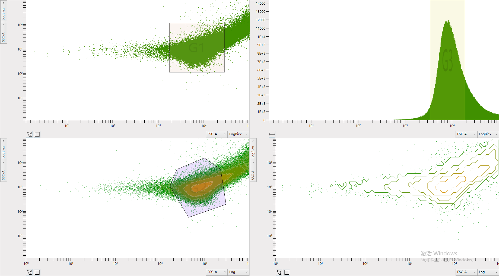

# FCSChart
 FCS文件图表控件
 
 图表类型有： 散点图（ScatterChart）、直方图（HistogramChart）、密度图（DensityChart）、等高线图（ContourChart）
 
 轴类型有：线性（Line）、对数（Log10）、负数对数（Log10Biex）
 
 门类型有：多边形门（PolygonGraphical）、四边形门（QuadrilateralGraphical）、段选门（VerticalGraphical）
 


## 文件目录结构 ##
| 名称 | 说明 |
| --- | --- |
| Axis | XY轴上的分隔刻度控件 |
| Converters | IValueConverter的实现类，用于值的转换，方便在WPF界面上显示 |
| FCSChart | 主要的图表控件，散点图、直方图、密度图、等高线图在此目录 |
| Graphical | 主要的门控件，多边形门、四边形门、段选门在此目录 |
| Series | 主要的图表数据显示控件，图表中心区域显示的内容由此目录下的类实现 |
| Themes | WPF样式模板等资源文件 |
| Chart | 图表控件基类 |
| ChartWithGraphicals | 带门绘制的图表控件基类 |
| DelegateCommand | ICommand实现类 |
| Helper | 帮助类，一些静态方法，包括随机颜色值等 |
| NotifyPropertyChanged | INotifyPropertyChanged实现类 |


## 图表控件主要属性 ##
 | 属性 | 含义 | 类型 | 说明 |
 | --- | --- | --- | --- |
 | ItemsSource | 数据源 | IEnumerable< IList > | 依赖属性，IList里的数据必须为可转成double的数据 |
 | Parameters | 参数集合 | IEnumerable | 依赖属性，FCS的参数集合，可对其在XY轴的选项控件（ComboBox）指定数据模板（XParamDataTemplate、YParamDataTemplate） |
 | PolygonCommand | 画多边形门命令 | ICommand | 依赖属性 |
 | QuadrilateralCommand | 画四边形门命令 | ICommand | 依赖属性 |
 | VerticalCommand | 画段选门命令 | ICommand | 依赖属性 |
 | ZoomType | 缩放方式 | AxisChangeType | 可指定鼠标滚轮缩放时，缩放X轴、Y轴或者两者都缩放或者都不缩放 |
 | MoveType | 移动方式 | AxisChangeType | 可指定鼠标左键在图表显示区域按下并移动时，X轴、Y轴或者两者或者都不跟随鼠标改变最大最小值 |
 | Graphicals | 门集合 | ObservableCollection< BaseGraphical > | 该图表内所绘制的门的集合，BaseGraphical.GraphicalModel属性是门的模型，记录门的名称、关键点位；BaseGraphical.Subset属性是门过滤数据源后的数据集； |
 | XAxisList | x轴类型选项 | IEnumerable< IAxis > | x轴上可用的轴类型选项，默认有线性、对数、可负数对数三种轴 |
 | YAxisList | y轴类型选项 | IEnumerable< IAxis > | y轴上可用的轴类型选项，默认有线性、对数、可负数对数三种轴 |
 | XAxis | x轴 | IAxis | x轴上使用的轴，可从XAxisList中选择，也可自定义轴，需要继承IAxis |
 | YAxis | y轴 | IAxis | y轴上使用的轴，可从YAxisList中选择，也可自定义轴，需要继承IAxis |

## 示例 ##
### 前端 ###
```
<Grid>
        <Grid.RowDefinitions>
            <RowDefinition/>
            <RowDefinition/>
        </Grid.RowDefinitions>
        <Grid.ColumnDefinitions>
            <ColumnDefinition/>
            <ColumnDefinition/>
        </Grid.ColumnDefinitions>
        <chart:ScatterChart ItemsSource="{Binding DataSegment}" Parameters="{Binding Params}" Grid.Row="1">
            <chart:ScatterChart.XParamDataTemplate>
                <DataTemplate>
                    <TextBlock Text="{Binding PnN}"/>
                </DataTemplate>
            </chart:ScatterChart.XParamDataTemplate>
            <chart:ScatterChart.YParamDataTemplate>
                <DataTemplate>
                    <TextBlock Text="{Binding PnN}"/>
                </DataTemplate>
            </chart:ScatterChart.YParamDataTemplate>
        </chart:ScatterChart>
        <chart:HistogramChart ItemsSource="{Binding DataSegment}" Parameters="{Binding Params}" Grid.Row="1" Grid.Column="1">
            <chart:HistogramChart.XParamDataTemplate>
                <DataTemplate>
                    <TextBlock Text="{Binding PnN}"/>
                </DataTemplate>
            </chart:HistogramChart.XParamDataTemplate>
        </chart:HistogramChart>
        <chart:DensityChart ItemsSource="{Binding DataSegment}" Parameters="{Binding Params}">
            <chart:DensityChart.XParamDataTemplate>
                <DataTemplate>
                    <TextBlock Text="{Binding PnN}"/>
                </DataTemplate>
            </chart:DensityChart.XParamDataTemplate>
            <chart:DensityChart.YParamDataTemplate>
                <DataTemplate>
                    <TextBlock Text="{Binding PnN}"/>
                </DataTemplate>
            </chart:DensityChart.YParamDataTemplate>
        </chart:DensityChart>
        <chart:ContourChart ItemsSource="{Binding DataSegment}" Parameters="{Binding Params}" Grid.Column="1">
            <chart:ContourChart.XParamDataTemplate>
                <DataTemplate>
                    <TextBlock Text="{Binding PnN}"/>
                </DataTemplate>
            </chart:ContourChart.XParamDataTemplate>
            <chart:ContourChart.YParamDataTemplate>
                <DataTemplate>
                    <TextBlock Text="{Binding PnN}"/>
                </DataTemplate>
            </chart:ContourChart.YParamDataTemplate>
        </chart:ContourChart>
    </Grid>
```
### 后端 ###
使用到[FCS](https://github.com/Lvwl-CN/FCS)库
```
            var fcss = FCS.Factory.ReadFCSFile(@"C:\test.fcs").ToList();
            if (fcss.Count > 0) this.DataContext = fcss[0];
```
